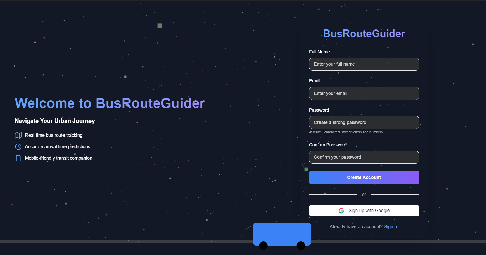
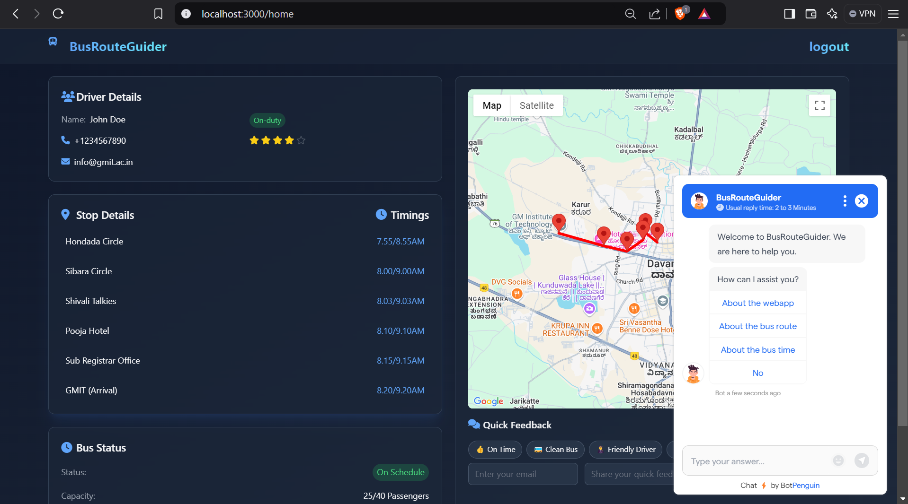

# BusRouteGuider 🚌

A web application for tracking and managing bus routes, schedules, and providing real-time feedback. Built with Node.js, Express, PostgreSQL, and Google Maps integration.

## Features

- 🗺️ Real-time bus route visualization using Google Maps
- 🔐 Secure authentication (Local & Google OAuth2)
- 📱 Responsive design with Tailwind CSS
- 📍 Interactive stop details and timings
- 📊 Bus capacity tracking
- ⭐ User feedback system
- 🚦 Live bus status updates

## Screenshots

### Home Page


### Route Visualization


## Prerequisites
 
Before running the application, make sure you have the following installed:
- Node.js (v14 or higher)
- PostgreSQL
- npm (Node Package Manager)
- Go Maps.pro API key

## Environment Variables

Create a `.env` file in the root directory with the following variables:

```env
DB_USER=your_db_user
DB_HOST=your_db_host
DB_NAME=your_db_name
DB_PASSWORD=your_db_password
DB_PORT=5432
SESSION_SECRET=your_session_secret
GOOGLE_CLIENT_ID=your_google_client_id
GOOGLE_CLIENT_SECRET=your_google_client_secret
PORT=3000
```

## Go Maps.pro API Setup

1. Go to the [GoMaps.pro](https://gomaps.pro/)
2. Create a new project or select an existing one
3. Enable the following APIs:
   - Maps JavaScript API
   - Places API (if needed)
   - Directions API (if needed)
   - Geocoding API (if needed)
4. Create (API key)
5. Add restrictions to your API key:
   - Application restrictions (HTTP referrers)
   - API restrictions (select only the APIs you need)
6. Replace the API key in your code:
   ```html
   <script src="https://maps.gomaps.pro/maps/api/js?key=YOUR_API_KEY&callback=initMap" async defer></script>
   ```

## Database Setup

1. Create a PostgreSQL database
2. Create a users table with the following structure:

```sql
CREATE TABLE users (
    id SERIAL PRIMARY KEY,
    full_name VARCHAR(100),
    email VARCHAR(100) UNIQUE NOT NULL,
    password VARCHAR(100) NOT NULL
);
```

## Installation

1. Clone the repository:
```bash
git clone https://github.com/ahamed-ali-git/BusRouteGuide.git
cd BusRouteGuide
```

2. Install dependencies:
```bash
npm install
```

3. Start the server:
```bash
nodemon index.js
```

4. Access the application at `http://localhost:3000`

## Authentication

The application supports two authentication methods:
1. Local authentication with email and password
2. Google OAuth2 authentication

## Features in Detail

### Bus Tracking
- Real-time location tracking
- Interactive route map
- Stop-wise timings
- Capacity monitoring

### User Features
- Secure login/registration
- Route visualization
- Quick feedback system with Formspree
- Star ratings

## License

This project is licensed under the MIT License - see the LICENSE file for details.

## Acknowledgments
- Go Maps.pro API for route visualization
- Tailwind CSS for styling
- Font Awesome for icons
- Express.js community
